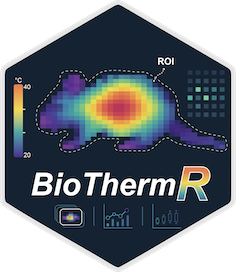

## BioThermR 

### an R package for standardized processing, visualization, and statistical analysis of thermal imaging data in animal studies

[](https://cran.r-project.org/web/packages/BioThermR/index.html)
[](https://cran.r-project.org/web/packages/BioThermR/index.html)


`BioThermR` is an R package designed to provide an end-to-end analysis
pipeline for infrared thermography (IRT) data in animal experimentation.
It addresses the lack of standardized, reproducible, and
batch-processing workflows in current thermal imaging analysis.

------------------------------------------------------------------------

Find out more at <https://github.com/RightSZ/BioThermR>

## Installation

`BioThermR` relies on `EBImage` from Bioconductor for image processing.
Please install it first:

``` r
if (!require("BiocManager", quietly = TRUE))
    install.packages("BiocManager")
BiocManager::install("EBImage")
```

Install the stable release from
[CRAN](https://CRAN.R-project.org/package=BioThermR) as follow:

``` r
# Install from CRAN
install.packages("BioThermR")
```

Install the latest development version from
[GitHub](https://github.com/RightSZ/BioThermR) as follow:

``` r
# Install the development version from GitHub
if (!require("devtools", quietly = TRUE))
    install.packages("devtools")
devtools::install_github("RightSZ/BioThermR")
```

## License

This package is licensed under the GPL-3.0 License. See the LICENSE file
for details.
